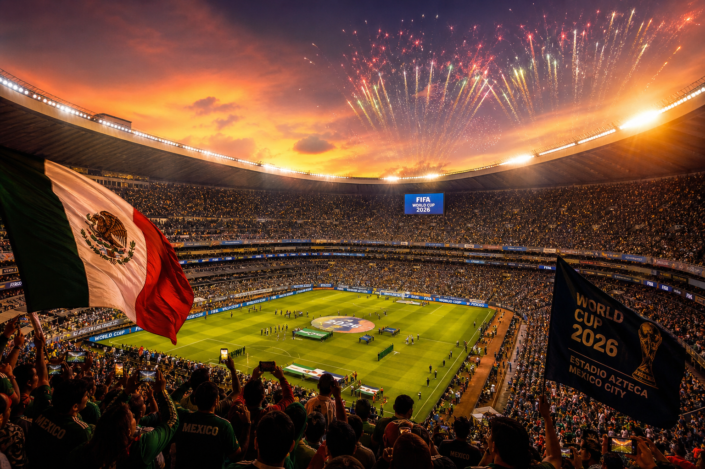
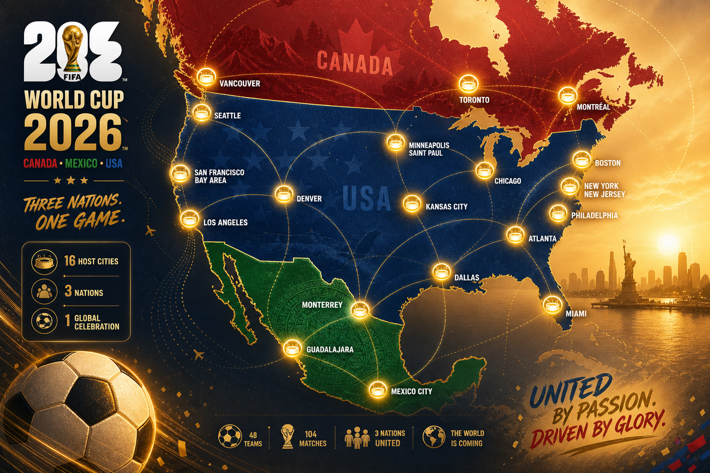
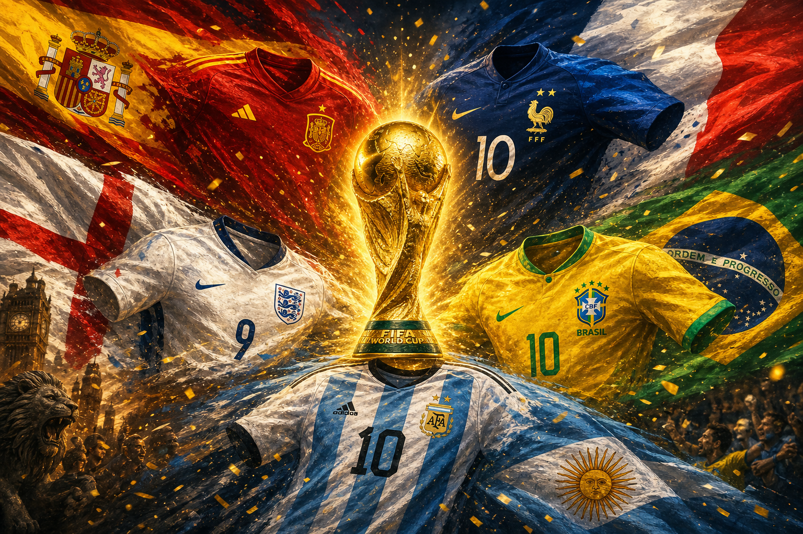

# מונדיאל 2026: הטורניר הגדול בהיסטוריה יוצא לדרך

תשעה ימים לפני שריקת הפתיחה, יבשת שלמה נושמת כדורגל. ב-11 ביוני 2026 ייפתח באצטדיון אסטקה במקסיקו סיטי המונדיאל ה-23 — וכבר עכשיו ברור שמדובר בטורניר ששובר את כל הקנה מידה שהכרנו. שלוש מדינות מארחות, 48 נבחרות, 104 משחקים ו-39 ימים של דרמה. זה לא עוד גביע עולם. זה הגדול מכולם.

## הפתיחה: מקסיקו פותחת, ארה"ב וקנדה נכנסות למחרת

משחק הפתיחה יפגיש את נבחרת מקסיקו המארחת מול דרום אפריקה, באצטדיון אסטקה ההיסטורי בלב הבירה — אותו מגרש אגדי שמכונה כיום גם אסטדיו בנורטה. לפני שריקת הפתיחה ייערך טקס פתיחה צבעוני שיחגוג את התרבות המקומית: על הבמה יעלו להקת הרוק Maná, אלחנדרו פרננדס, בלינדה, לילה דאונס ולהקת הקומביה Los Ángeles Azules, לצד אורחים בינלאומיים — Tyla מדרום אפריקה, J Balvin מקולומביה ו-Danny Ocean מוונצואלה.

שתי המארחות הנוספות לא ייאלצו לחכות זמן רב: נבחרות ארצות הברית וקנדה יפתחו את מסען כבר ב-12 ביוני, יום אחד בלבד אחרי הפתיחה החגיגית.

## חידוש היסטורי: שלוש מדינות, 48 נבחרות

זהו המונדיאל הראשון אי פעם שמתארח בשלוש מדינות במקביל — ארצות הברית, קנדה ומקסיקו חוברות יחד לאירוח משותף. וזה גם המונדיאל הראשון שמרחיב את שדה המשתתפות ל-48 נבחרות, במקום 32 — הרחבה דרמטית שפותחת את הדלת לעוד אומות, עוד יבשות ועוד סיפורים.

כדי להכיל את הענק הזה גויסו 16 ערים מארחות: 11 בארצות הברית, 3 במקסיקו ו-2 בקנדה. בצד האמריקאי ישחקו בדאלאס, אטלנטה, יוסטון, קנזס סיטי, בוסטון, מיאמי, פילדלפיה, סיאטל, מפרץ סן פרנסיסקו, לוס אנג'לס וניו יורק/ניו ג'רזי. במקסיקו יארחו מקסיקו סיטי, מונטריי וגוודלחרה, ובקנדה — טורונטו וונקובר. הערים חולקו לשלושה אזורים גיאוגרפיים — מערב, מרכז ומזרח — כדי לצמצם את מרחקי הנסיעה האדירים של הנבחרות והאוהדים.

## פורמט חדש: 12 בתים ודרך ארוכה יותר לגמר

המבנה המורחב הביא איתו פורמט חדש לגמרי. 48 הנבחרות חולקו ל-12 בתים של ארבע קבוצות כל אחד, וכל נבחרת תשחק שלושה משחקי בית. שתי הראשונות בכל בית עולות הלאה, ואליהן יצטרפו שמונה הנבחרות הטובות ביותר מבין אלה שסיימו במקום השלישי — מה שמרכיב שלב נוקאאוט מורחב בן 32 נבחרות.

המשמעות בשטח: 104 משחקים לאורך הטורניר, לעומת 64 בלבד בעבר. נבחרת שתצעד עד הגמר עלולה לשחק עד שמונה משחקים — מסע ארוך ותובעני שיבחן לא רק כישרון, אלא גם עומק סגל וכושר גופני.

## הפייבוריטיות: ספרד וצרפת בראש, וארגנטינה רוצה לחזור

לפי ההימורים, ספרד וצרפת נכנסות לטורניר כפייבוריטיות משותפות. מיד אחריהן מדורגות אנגליה וברזיל, ולא הרחק מהן — האלופה המכהנת ארגנטינה, שהרימה את הגביע ב-2022 ומבקשת להגן על הכתר. לפי תוצאות ההגרלה והדירוג, ספרד וארגנטינה ניצבות כמועמדות בולטות לצד צרפת ואנגליה — שתיהן הופרדו זו מזו כך שיוכלו להיפגש, אם בכלל, רק בגמר עצמו.

## ההכנות האחרונות: סגלים, ידידות והסתגלות לחום

ככל שמתקרבת הפתיחה, גוברת המתיחות. כל 48 הנבחרות הגישו ל-FIFA את סגליהן הסופיים — 26 שחקנים כל אחת — עד ה-1 ביוני, ופרסמו אותם רשמית בסמוך לכך. ברשימות בולטים שמות גדולים: ניימאר, ויניסיוס ג'וניור ורפיניה מברזיל; קיליאן אמבפה מצרפת; כריסטיאן פוליסיץ' שמוביל את נבחרת ארצות הברית תחת המאמן מאוריסיו פוצ'טינו; והשוער הוותיק גיירמו אוצ'ואה, שממשיך לשמור על שער מקסיקו.

במקביל, הנבחרות מנצלות את הימים האחרונים למשחקי ידידות עד ערב הפתיחה ממש. אנגליה, תחת תומאס טוכל, תפגוש את ניו זילנד ב-6 ביוני ואת קוסטה ריקה ב-10 ביוני — שני המשחקים בדרום פלורידה, במכוון, כדי להתרגל לחום הקיץ הכבד שצפוי ללוות חלק ניכר מהמשחקים בארצות הברית.

## הצללים שמלווים את החגיגה

מאחורי ההתרגשות מלווים את הטורניר גם כמה עננים. החלוץ השוויצרי ברל אמבולו לא המריא עם הסגל לארצות הברית, לאחר שאישור הכניסה שלו (ESTA) הועבר לבדיקה נוספת. ברקע ניכרים מתחים פוליטיים בין ארצות הברית למקסיקו ולקנדה, על רקע מכסי המכס והרטוריקה הנלווית — מתחים שאינם נעצרים בשערי האצטדיונים.

לכך מתווספים חששות מעשיים: איסורי נסיעה שעלולים למנוע מאוהדים להגיע, מחירי כרטיסים שמאמירים, ודיווחים על נוכחות אפשרית של סוכני הגירה (ICE) במשחקים. כל אלה מטילים צל קל על מה שאמור להיות חגיגת הכדורגל הגדולה בתולדות הספורט.

## שורה תחתונה

מונדיאל 2026 הוא לא רק עוד פרק בסיפור הכדורגל — הוא נקודת מפנה. טורניר גדול יותר, רחב יותר וגלובלי יותר מכל מה שקדם לו. בעוד ימים ספורים, כשהכדור יתחיל להתגלגל באסטקה, יתחיל גם הפרק החדש הזה להיכתב. הספירה לאחור החלה.
